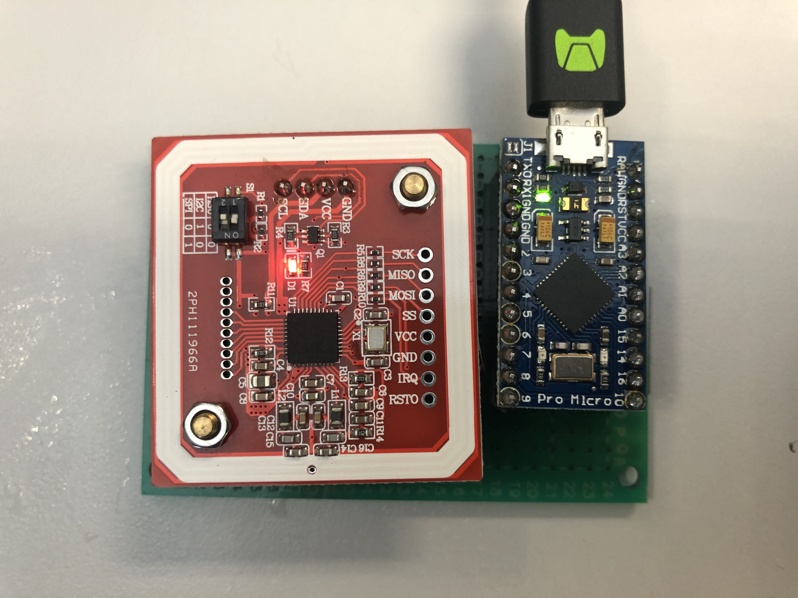

# Octopus Card Desktop Unlocker


[](https://youtu.be/BrJiKIZDRS0)
^ Click this photo to view the demo video.

# Introduction

Unlock your Desktop with your smart Octopus Card.


# Supported Hardware

PN532 NFC chip

Arduino Leonardo

Tested on a physical Octopus Card.

Tested on a Smart Octopus on iPhone X and Apple watch series 5.

# Installation

### Install PN532 NFC Arduino Library

Download the [Seeed-Studio PN532 NFC Library](https://github.com/Seeed-Studio/PN532).

Put all of the necessary files to one Folder and put this folder to the Arduino library directory.

```
# Necessary files: 
PN532.cpp
PN532.h
PN532Interface.h
PN532_HSU.cpp
PN532_HSU.h
PN532_I2C.cpp
PN532_I2C.h
PN532_SPI.cpp
PN532_SPI.h
PN532_SWHSU.cpp
PN532_SWHSU.h
PN532_debug.h
```


# Usage

Type your Octopus Card ID and your computer login password in `program_setting.h`.

Flash the program to any Arduino Board. i2c connection is recommended.

Connect the Arduino board to your computer using a USB cable.

Tap your Octopus Card on the reader and unlock your computer.

# Implementation

This program will read your Octopus Card ID and compare the stored card ID. If the card ID is matched, the Arduino will unlock your computer.

The program emulates a USB HID keyboard and type the login password for you. This may have some security problems since the password is store in your Arduino in the "Plain Text" format. 

It is a little bit difficult but possible that some people stole your device and scan the Arduino ROM to obtain your computer password.


Use it at your own risk!!!

# Disclaimer

Using this software and hardware design improperly may damage your phone and Octopus Card. You follow the steps at your own risk. I am not to be held liable for your belongings.


# Reference
https://github.com/Seeed-Studio/PN532
https://github.com/metrodroid/metrodroid/wiki/Octopus
https://blog.kalan.dev/core-nfc-en/